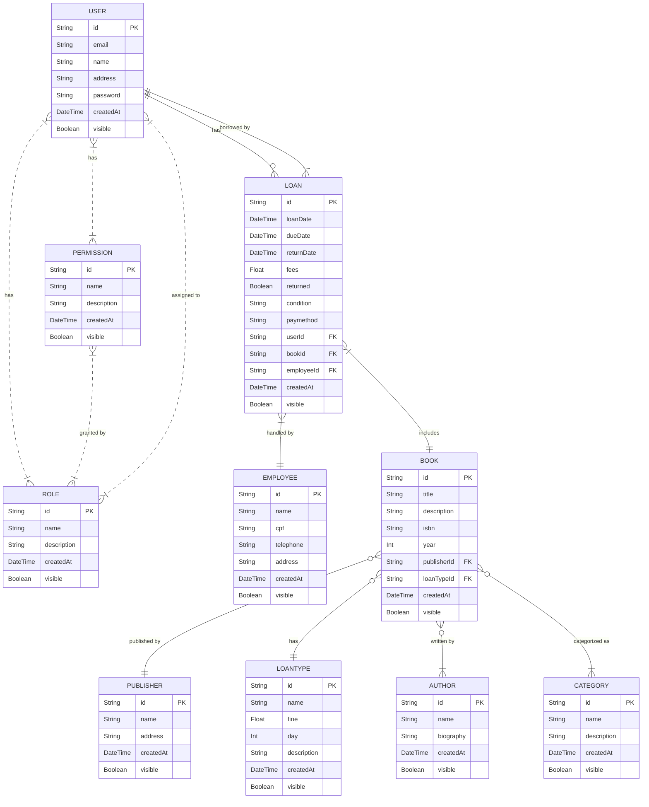

# API-COMP-JUNIOR

## Índice
- [Descrição do Projeto](#descrição)
- [Tecnologias Utilizadas](#descrição)
- [Modelagem de Dados](#descrição)
- [Arquitetura e Organização de Código](#descrição)
- [Instalação](#instalação)
- [Configuração](#configuração)
- [Uso](#uso)
- [Testes](#testes)
- [Contribuição](#contribuição)
- [Licença](#licença)
- [Autores](#autores)
- [Contato](#contato)
- [Changelog](#changelog)

## Descrição
Lorem ipsum dolor sit amet, consectetur adipiscing elit. Vestibulum luctus a nisl vel blandit. Sed ut lorem pulvinar, fermentum ante ac, tempor ex. Pellentesque rhoncus vestibulum est, sit amet porttitor massa pretium quis. Aenean hendrerit, justo sed lobortis hendrerit, magna mi egestas leo, eget maximus magna lorem eget felis. Nam aliquet tortor eget augue sagittis, semper dapibus urna tincidunt. Interdum et malesuada fames ac ante ipsum primis in faucibus. Integer nibh elit, mattis in tellus ut, varius viverra enim. Nam aliquam nulla vel urna hendrerit euismod. Nam erat turpis, dignissim at tincidunt rutrum, vulputate at turpis. Mauris nec pellentesque mauris. Ut magna ante, mollis vestibulum fermentum id, fringilla in neque.

## Tecnologias Utilizadas 🚀

- **MySql**: Um sistema de gerenciamento de banco de dados relacional, usado como armazenamento de dados do projeto.

- **Prisma**: Um ORM (Object-Relational Mapping) utilizado para gerenciar as interações com o banco de dados.

- **TypeScript**: Linguagem de programação que adiciona tipos estáticos ao JavaScript

- **Jest**: Framework de testes em JavaScript, usado para escrever e executar testes unitários.

- **NodeJS**: Ambiente de execução para JavaScript server-side, permitindo a criação de aplicações de alta performance.

- **Express**: Framework web para Node.js, facilitando a criação de APIs RESTful.

- **bcrypt**: Biblioteca para hashing de senhas, garantindo a segurança dos dados dos usuários.

- **jsonwebtoken**: Biblioteca para trabalhar com JSON Web Tokens (JWT), usada para autenticação e autorização.

- **nodemailer**: Biblioteca para envio de e-mails em aplicações Node.js.

- **prisma-dbml-generator**: Biblioteca para envio de e-mails em aplicações Node.js.

- **Git**: Framework de testes em JavaScript.

- **GitHub**: Framework de testes em JavaScript.

## Modelagem de Dados

### Diagrama de Entidades

### Dicionário de Entidades

#### User
- `id`: Identificador único do usuário (UUID).
- `email`: Email do usuário (único).
- `name`: Nome do usuário (opcional).
- `address`: Endereço do usuário (opcional).
- `password`: Senha do usuário.
- `visible`: Indica se o usuário está visível.
- `createdAt`: Data de criação do usuário.

#### Permission
- `id`: Identificador único da permissão (UUID).
- `name`: Nome da permissão (único).
- `description`: Descrição da permissão (opcional).
- `visible`: Indica se a permissão está visível.
- `createdAt`: Data de criação da permissão.

#### Role
- `id`: Identificador único do papel (UUID).
- `name`: Nome do papel (único).
- `description`: Descrição do papel (opcional).
- `visible`: Indica se o papel está visível.
- `createdAt`: Data de criação do papel.

#### Author
- `id`: Identificador único do autor (UUID).
- `name`: Nome do autor (único).
- `biography`: Biografia do autor (opcional).
- `visible`: Indica se o autor está visível.
- `createdAt`: Data de criação do autor.

#### Publisher
- `id`: Identificador único da editora (UUID).
- `name`: Nome da editora (único).
- `address`: Endereço da editora (opcional).
- `visible`: Indica se a editora está visível.
- `createdAt`: Data de criação da editora.

#### Category
- `id`: Identificador único da categoria (UUID).
- `name`: Nome da categoria (único).
- `description`: Descrição da categoria (opcional).
- `visible`: Indica se a categoria está visível.
- `createdAt`: Data de criação da categoria.

#### Employee
- `id`: Identificador único do empregado (UUID).
- `name`: Nome do empregado.
- `cpf`: CPF do empregado (único).
- `telephone`: Telefone do empregado (opcional).
- `address`: Endereço do empregado (opcional).
- `visible`: Indica se o empregado está visível.
- `createdAt`: Data de criação do empregado.

#### Book
- `id`: Identificador único do livro (UUID).
- `title`: Título do livro.
- `description`: Descrição do livro (opcional).
- `isbn`: ISBN do livro (único).
- `year`: Ano de publicação do livro.
- `publisherId`: Identificador da editora (chave estrangeira).
- `loanTypeId`: Identificador do tipo de empréstimo (chave estrangeira).
- `visible`: Indica se o livro está visível.
- `createdAt`: Data de criação do livro.

#### Loan
- `id`: Identificador único do empréstimo (UUID).
- `loanDate`: Data do empréstimo.
- `dueDate`: Data de devolução prevista.
- `returnDate`: Data de devolução efetiva (opcional).
- `fees`: Multa.
- `returned`: Indica se o livro foi devolvido.
- `condition`: Condição do livro (opcional).
- `paymethod`: Método de pagamento (opcional).
- `userId`: Identificador do usuário (chave estrangeira).
- `bookId`: Identificador do livro (chave estrangeira).
- `employeeId`: Identificador do empregado (chave estrangeira).
- `visible`: Indica se o empréstimo está visível.
- `createdAt`: Data de criação do empréstimo.

#### LoanType
- `id`: Identificador único do tipo de empréstimo (UUID).
- `name`: Nome do tipo de empréstimo (único).
- `fine`: Multa do tipo de empréstimo.
- `day`: Dias permitidos para o tipo de empréstimo.
- `description`: Descrição do tipo de empréstimo (opcional).
- `visible`: Indica se o tipo de empréstimo está visível.
- `createdAt`: Data de criação do tipo de empréstimo.

### Relacionamentos

- **User**
  - Um usuário pode ter múltiplos empréstimos (Loan).
  - Um usuário pode ter múltiplos papéis (Role).
  - Um usuário pode ter múltiplas permissões (Permission).

- **Permission**
  - Uma permissão pode estar associada a múltiplos papéis (Role).
  - Uma permissão pode estar associada a múltiplos usuários (User).

- **Role**
  - Um papel pode ter múltiplas permissões (Permission).
  - Um papel pode estar associado a múltiplos usuários (User).

- **Author**
  - Um autor pode ter múltiplos livros (Book).

- **Publisher**
  - Uma editora pode publicar múltiplos livros (Book).

- **Category**
  - Uma categoria pode conter múltiplos livros (Book).

- **Employee**
  - Um empregado pode gerenciar múltiplos empréstimos (Loan).

- **Book**
  - Um livro pode ter múltiplos autores (Author).
  - Um livro pode pertencer a múltiplas categorias (Category).
  - Um livro pode estar incluído em múltiplos empréstimos (Loan).
  - Um livro pode estar publicado em apenas uma editora (Publisher).
  - Um livro pode pertencer em apenas um tipo de emprestimo (LoanType).

- **Loan**
  - Um empréstimo está associado a um único usuário (User).
  - Um empréstimo está associado a um único livro (Book).
  - Um empréstimo é gerenciado por um único empregado (Employee).

- **LoanType**
  - Um tipo de empréstimo pode estar associado a múltiplos livros (Book).
